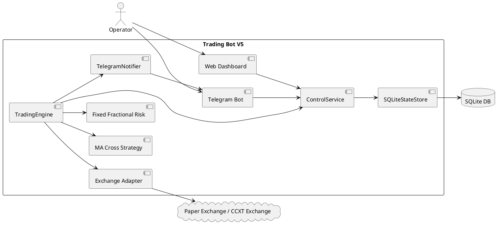
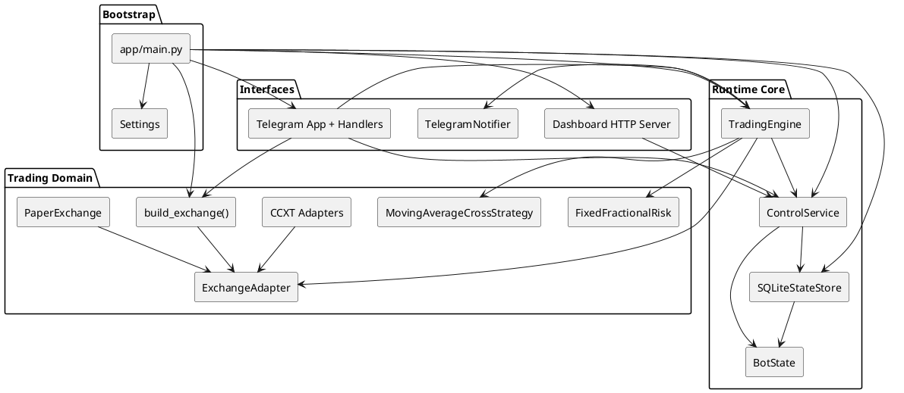

# Architecture Overview

## Mục tiêu hệ thống

Trading Bot V5 là một bot giao dịch có 3 mặt chính:

- chạy vòng lặp trading theo chu kỳ polling
- cho phép điều khiển runtime qua Telegram
- cung cấp dashboard HTTP nội bộ để quan sát trạng thái

## Context Diagram

## Component Diagram

## Trách nhiệm chính

### `app/main.py`

- load `Settings`
- tạo `SQLiteStateStore`
- nạp hoặc khởi tạo `BotState`
- tạo `ControlService`
- build exchange, strategy, risk, notifier, engine
- bật dashboard nếu enable
- bật Telegram bot nếu có token
- chạy `TradingEngine` trên thread riêng

### `ControlService`

- là lớp điều phối runtime state dùng chung
- expose status cho Telegram và dashboard
- xử lý pause/resume, auto on/off, mode, exchange, language, symbol
- tách persistence thành:
  - `persist_runtime_config()`
  - `persist_engine_state()`

### `TradingEngine`

- chạy vòng lặp `run_forever()`
- set heartbeat theo chu kỳ poll
- sync state từ exchange vào `BotState`
- bảo vệ vị thế bằng stop loss, take profit, trailing stop
- suppress các lần thử close lặp lại cho dust positions nhỏ hơn mức tối thiểu của sàn
- gọi strategy để sinh tín hiệu
- gọi risk layer để tính size lệnh
- gửi thông báo trade hoặc error qua notifier

### `SQLiteStateStore`

- lưu `BotState` dạng key-value JSON trong SQLite
- hỗ trợ nạp state sau restart
- tách runtime config và engine state để giảm phạm vi ghi

### `Exchange Layer`

- `build_exchange()` quyết định dùng `PaperExchange` hay CCXT adapter
- `PaperExchange` mô phỏng balance, positions, open orders và fill limit order
- CCXT adapters đóng vai trò kết nối sàn thật khi chạy live mode

### `Telegram Layer`

- kiểm soát truy cập theo `allowed_user_ids`
- hỗ trợ command và inline keyboard
- thay đổi runtime config thông qua `ControlService`
- hot-swap exchange khi đổi mode hoặc đổi exchange
- hỗ trợ manual order cho `spot/future`, gồm market, limit, close position, margin mode, leverage và quote-notional cho lệnh buy

### `Dashboard Layer`

- phục vụ HTML page, `/api/status` và `/api/chart`
- đọc trực tiếp trạng thái hiện tại từ `ControlService`
- refresh client-side mỗi 3 giây
- render candlestick chart dark-theme bằng frontend chart library, có MA line, volume, chọn timeframe và `spot/future`

## Luồng dữ liệu cốt lõi

1. `TradingEngine` lấy market data từ exchange.
2. Strategy sinh tín hiệu từ OHLCV.
3. Risk layer tính khối lượng hợp lệ theo balance và symbol rules.
4. Engine đặt lệnh qua exchange.
5. Exchange state được đồng bộ ngược về `BotState`.
6. `ControlService` persist state vào SQLite.
7. Telegram và dashboard đọc cùng một nguồn state đó.

## Decision đáng chú ý

- Dùng polling thay vì websocket để giữ implementation đơn giản.
- Chạy engine ở thread riêng để không block Telegram polling.
- Dashboard là HTTP server nội bộ tối giản, không phụ thuộc framework web nặng.
- Trailing stop hiện nằm ở tầng ứng dụng thay vì native order của sàn.
