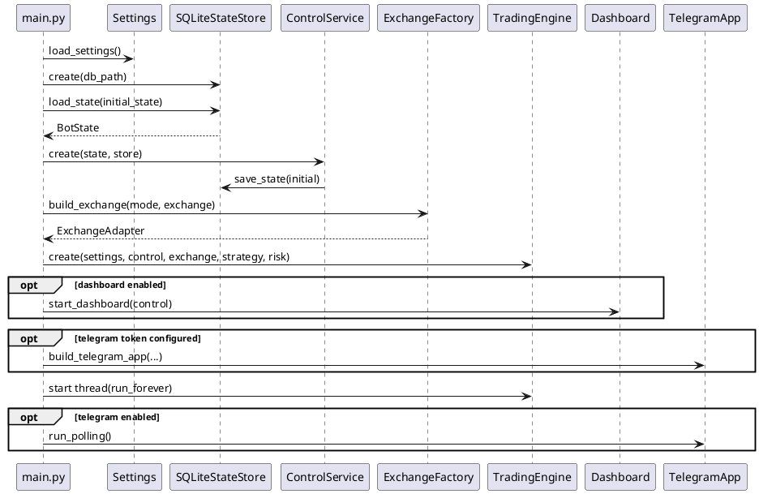
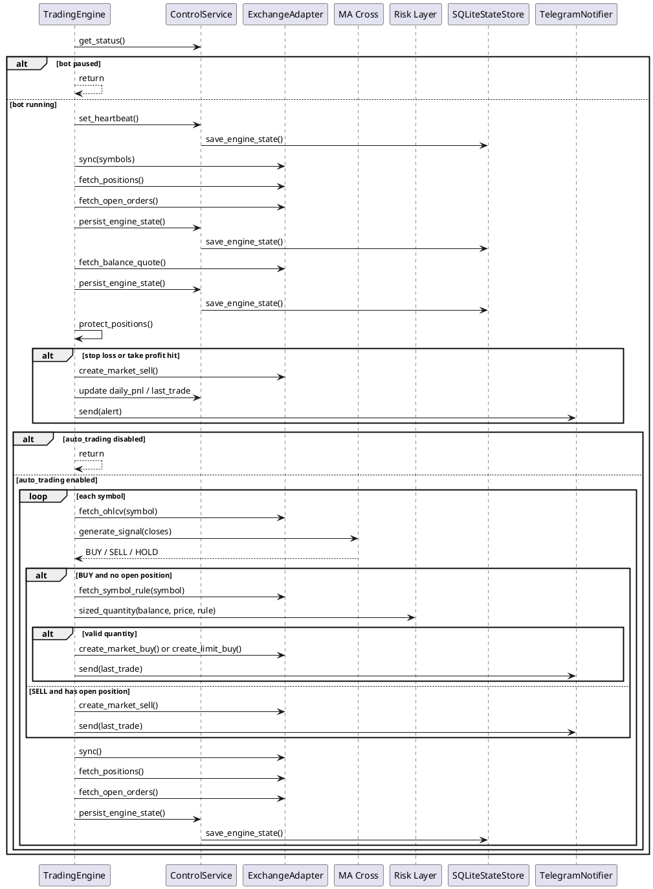
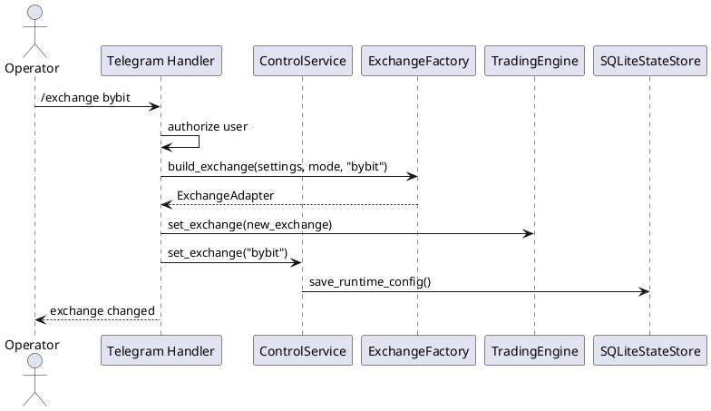
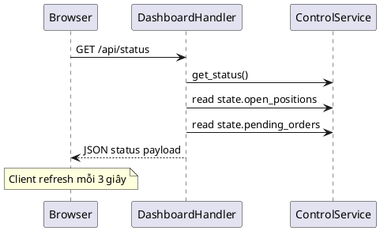
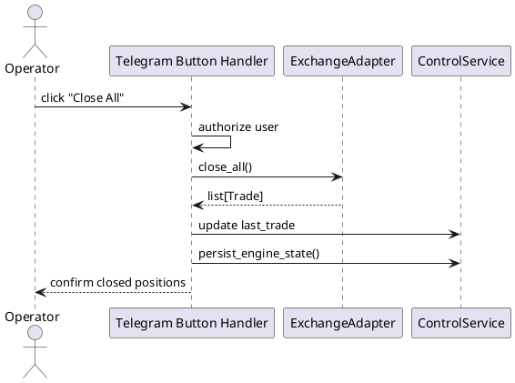

# Sequence Diagrams

## 1. Startup Sequence

## 2. Trading Polling Sequence

## 3. Telegram Control Sequence

## 4. Dashboard Read Sequence

## 5. Close-All Sequence

## Ghi chú

- `mode` hoặc `exchange` đổi qua Telegram sẽ hot-swap adapter bên trong engine.
- Dashboard là read-only trong version hiện tại.
- Engine loop hiện là polling tuần tự, chưa song song theo symbol.
