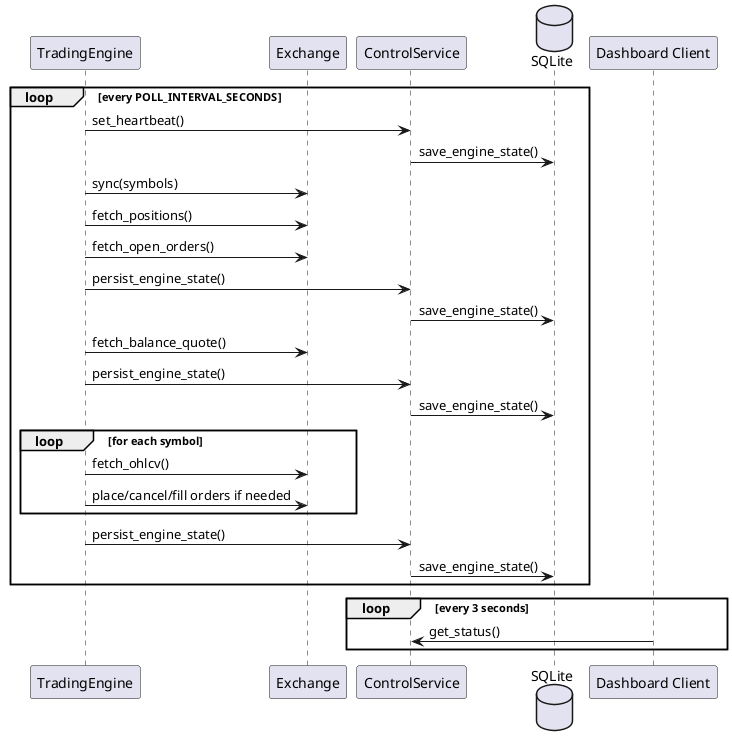
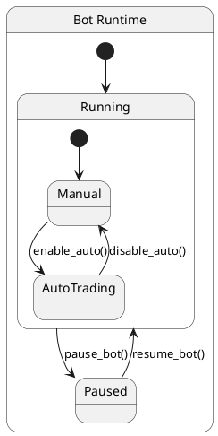

# Timing And State

## Chu kỳ runtime

Trading engine chạy theo vòng lặp:

```text
while not stopped:
  step()
  sleep(POLL_INTERVAL_SECONDS)
```

Nguồn cấu hình là `settings.poll_interval_seconds`.

## Timing Diagram



## Heartbeat

- `heartbeat_ts` được set ở đầu mỗi `step()`
- lệnh `/health` tính `age = now - heartbeat_ts`
- trạng thái được xem là stale nếu:

```text
age >= 2 * POLL_INTERVAL_SECONDS
```

Điều này có nghĩa health check hiện là indicator rất trực tiếp của việc engine loop còn chạy hay không.

## State model

`BotState` gồm 3 nhóm dữ liệu chính:

## UML State View



### 1. Runtime config

- `bot_running`
- `auto_trading`
- `mode`
- `exchange`
- `language`
- `symbols`
- các giá trị `default_*`
- `allowed_exchanges`

Nhóm này thay đổi chủ yếu qua Telegram control.

### 2. Engine state

- `balance_quote`
- `daily_pnl`
- `open_positions`
- `pending_orders`
- `last_signal`
- `last_trade`
- `heartbeat_ts`
- `last_error`

Nhóm này thay đổi chủ yếu trong `TradingEngine.step()`.

### 3. Derived operational state

- dữ liệu render cho dashboard
- dữ liệu phản hồi cho `/status` và `/health`

## Persistence strategy

`SQLiteStateStore` lưu dữ liệu vào bảng `bot_state(key, value)`.

Thiết kế hiện tại tách ghi theo hai hướng:

- `save_runtime_config()`: ghi phần cấu hình điều khiển
- `save_engine_state()`: ghi phần trạng thái runtime do engine cập nhật

Lợi ích:

- Telegram command không phải ghi lại toàn bộ state engine
- engine loop có thể persist thường xuyên mà không ghi đè toàn bộ runtime config logic

## Đồng bộ state với exchange

Trong mỗi `step()`:

1. gọi `exchange.sync(symbols)`
2. đọc `fetch_positions()`
3. đọc `fetch_open_orders()`
4. map sang `BotState.open_positions` và `BotState.pending_orders`
5. persist vào SQLite

Ý nghĩa:

- state hiển thị ra Telegram/dashboard luôn phản ánh exchange adapter hiện tại
- với `PaperExchange`, lệnh limit có thể được fill trong lúc `sync()`

## Timing của protective logic

Protective logic chạy trước strategy entry:

1. trailing stop được cập nhật theo giá hiện tại
2. nếu chạm stop loss thì thoát lệnh ngay
3. nếu chạm take profit thì thoát lệnh ngay
4. chỉ sau đó engine mới xét tín hiệu strategy mới

Thứ tự này làm giảm khả năng bot mở thêm vị thế khi vị thế cũ vừa nên bị đóng vì rule bảo vệ.

## Timing của mode/exchange switch

Khi operator đổi mode hoặc exchange qua Telegram:

1. handler cập nhật runtime config trong `ControlService`
2. handler build exchange adapter mới
3. engine nhận adapter mới qua `set_exchange()`
4. chu kỳ polling kế tiếp dùng adapter mới

Lưu ý:

- quá trình đổi adapter hiện không có handshake dừng-và-chạy lại engine loop
- vì vậy đây là hot-swap nhẹ ở runtime, phù hợp với bot đơn giản nhưng chưa phải orchestration chặt cho production
