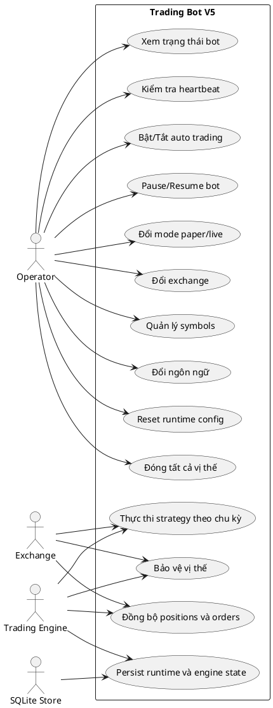

# Use Cases

## Actors

- `Operator`: người vận hành bot qua Telegram và dashboard
- `Trading Engine`: actor nội bộ thực thi chiến lược và quản lý vị thế
- `Exchange`: hệ thống ngoài cung cấp market data và nhận lệnh
- `SQLite Store`: thành phần lưu state bền vững

## User-Case Diagram

## Use case chính

### 1. Giám sát runtime

Operator có thể:

- xem trạng thái hiện tại qua Telegram `/status`
- kiểm tra heartbeat qua `/health`
- xem dashboard HTML hoặc JSON `/api/status`

Kết quả nhận được gồm:

- mode, exchange, language
- symbols
- balance, daily PnL
- open positions, pending orders
- last signal, last trade, last error

### 2. Điều khiển bot

Operator có thể:

- pause/resume bot
- bật hoặc tắt auto trading
- đổi ngôn ngữ giao diện
- reset runtime config về default

Các thao tác này đi qua `ControlService` và được persist vào SQLite.

### 3. Chuyển mode hoặc exchange

Operator có thể:

- đổi giữa `paper` và `live`
- đổi giữa `paper`, `binance`, `bybit`, `mexc`

Hệ thống sẽ:

- cập nhật runtime config trong state
- build lại exchange adapter
- gán exchange mới cho engine

### 4. Quản lý danh sách symbol

Operator có thể:

- xem symbols đang theo dõi
- thêm symbol mới
- xóa symbol khỏi runtime config

Danh sách mới sẽ ảnh hưởng trực tiếp tới vòng lặp polling kế tiếp của engine.

### 5. Thực thi giao dịch theo chiến lược

Trading Engine sẽ:

- lấy dữ liệu OHLCV
- tính tín hiệu MA crossover
- tính size lệnh theo risk
- gửi market/limit order
- đồng bộ lại position/order vào state

### 6. Bảo vệ vị thế

Trading Engine theo dõi:

- stop loss
- take profit
- trailing stop

Khi điều kiện bảo vệ khớp:

- engine đóng vị thế
- cập nhật PnL
- persist state
- gửi thông báo qua Telegram notifier

## Ranh giới hệ thống

- Telegram và dashboard là interface ngoài đi vào cùng một runtime state.
- Exchange là dependency ngoài duy nhất trong flow giao dịch.
- SQLite là nơi giữ trạng thái để bot khôi phục sau restart.
